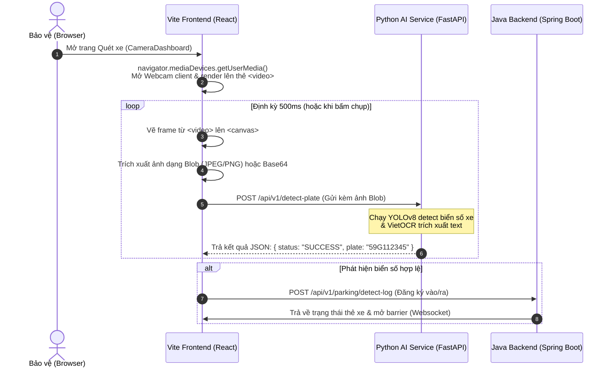

# KẾ HOẠCH CHUYỂN ĐỔI KIẾN TRÚC THU HÌNH CAMERA (CAMERA MIGRATION PLAN)
*Từ Đọc Camera ở Backend (Python) sang Đọc Camera ở Client (UI/Trình duyệt)*

---

## 1. ĐẶT VẤN ĐỀ & LÝ DO CẦN CHUYỂN ĐỔI

### Kiến trúc hiện tại:
* **Cơ chế**: Máy chủ Python (`AI_Services`) trực tiếp mở webcam bằng thư viện OpenCV (`cv2.VideoCapture(0)`) hoặc đọc RTSP stream, thực hiện nhận diện liên tục và đẩy kết quả sang Java Backend.
* **Hạn chế lớn nhất**:
  * **Không thể triển khai Cloud (Docker/AWS)**: Khi triển khai máy chủ lên đám mây hoặc chạy trong Docker container, máy chủ ảo không có webcam vật lý kết nối cổng USB. Lệnh `cv2.VideoCapture(0)` sẽ lập tức báo lỗi và sập luồng.
  * **Thiếu linh hoạt**: Mỗi cổng vào/ra bắt buộc phải kết nối vật lý với máy tính chạy AI. Không thể mở rộng hệ thống cho nhiều máy khách (client) cùng quét biển số xe cùng lúc bằng điện thoại hoặc máy tính bảng.

### Kiến trúc đề xuất (UI-Based Camera Capture):
* **Cơ chế**: Trình duyệt của nhân viên bảo vệ (Vite Admin UI) sẽ sử dụng HTML5 Web Camera API (`navigator.mediaDevices.getUserMedia()`) để mở webcam cục bộ ngay trên thiết bị. Định kỳ chụp frame ảnh và gửi qua mạng (HTTP hoặc WebSocket) lên đám mây Python AI để xử lý.
* **Ưu điểm**:
  * Đưa máy chủ AI và Java lên Cloud/Docker thoải mái.
  * Hỗ trợ mọi thiết bị đầu cuối miễn là có trình duyệt web và camera (Điện thoại, iPad, máy tính bàn).

---

## 2. KIẾN TRÚC HỆ THỐNG MỚI (PROPOSED ARCHITECTURE)



---

## 3. THIẾT KẾ CHI TIẾT CÁC BƯỚC TRIỂN KHAI

### BƯỚC 1: Xây dựng API nhận diện tĩnh trên Python (FastAPI)
Thay vì tự động loop đọc camera ở backend, Python AI chỉ đóng vai trò là một **Stateless Service** (nhận ảnh -> trả biển số).

* **Endpoint**: `/api/v1/detect-plate` (POST)
* **Payload**: `multipart/form-data` chứa file ảnh chụp từ UI.
* **Mẫu Code Backend Python**:
```python
from fastapi import APIRouter, UploadFile, File
import cv2
import numpy as np

router = APIRouter()

@router.post("/api/v1/detect-plate")
async def detect_plate_from_ui(file: UploadFile = File(...)):
    # 1. Đọc file ảnh từ request gửi lên
    contents = await file.read()
    nparr = np.frombuffer(contents, np.uint8)
    frame = cv2.imdecode(nparr, cv2.IMREAD_COLOR)
    
    # 2. Chạy YOLO detect biển số
    # (Tận dụng logic crop và OCR sẵn có trong hệ thống)
    plate_results = process_license_plate_frame(frame) 
    
    if plate_results:
        return {
            "status": "SUCCESS",
            "plate": plate_results["best_plate"],
            "confidence": plate_results["confidence"]
        }
    return {"status": "FAILED", "message": "No plate detected"}
```

---

### BƯỚC 2: Mở Webcam và Chụp ảnh trên React Frontend (Vite)
Sử dụng thẻ `<video>` để hiển thị luồng live và thẻ `<canvas>` ẩn để chụp ảnh.

* **Code React Component minh họa (`CameraDashboard.jsx` mới)**:
```javascript
import React, { useRef, useEffect, useState } from "react";
import axios from "axios";

export default function CameraDashboardNew() {
  const videoRef = useRef(null);
  const canvasRef = useRef(null);
  const [detectedPlate, setDetectedPlate] = useState("");

  useEffect(() => {
    // 1. Yêu cầu mở webcam của trình duyệt
    navigator.mediaDevices.getUserMedia({ video: { width: 1280, height: 720 } })
      .then((stream) => {
        if (videoRef.current) videoRef.current.srcObject = stream;
      })
      .catch((err) => console.error("Lỗi mở camera:", err));
  }, []);

  // 2. Hàm chụp frame từ <video> gửi lên AI Server
  const captureAndDetect = async () => {
    const video = videoRef.current;
    const canvas = canvasRef.current;
    if (!video || !canvas) return;

    const ctx = canvas.getContext("2d");
    // Vẽ frame hiện tại của video lên canvas ẩn
    ctx.drawImage(video, 0, 0, canvas.width, canvas.height);

    // Chuyển canvas thành file ảnh dạng Blob
    canvas.toBlob(async (blob) => {
      if (!blob) return;

      const formData = new FormData();
      formData.append("file", blob, "frame.jpg");

      try {
        const response = await axios.post("http://localhost:8000/api/v1/detect-plate", formData, {
          headers: { "Content-Type": "multipart/form-data" }
        });
        
        if (response.data.status === "SUCCESS") {
          setDetectedPlate(response.data.plate);
          // Gửi log tiếp sang Java Backend ở đây
        }
      } catch (err) {
        console.error("Lỗi gọi API nhận dạng:", err);
      }
    }, "image/jpeg", 0.8);
  };

  // Cấu hình chạy định kỳ 500ms
  useEffect(() => {
    const interval = setInterval(captureAndDetect, 500);
    return () => clearInterval(interval);
  }, []);

  return (
    <div className="camera-container">
      {/* Hiển thị luồng trực tiếp */}
      <video ref={videoRef} autoPlay playsInline width="640" height="360" />
      {/* Canvas ẩn phục vụ chụp ảnh */}
      <canvas ref={canvasRef} width="640" height="360" style={{ display: "none" }} />
      <div>Biển số nhận diện: <strong>{detectedPlate || "Chưa phát hiện"}</strong></div>
    </div>
  );
}
```

---

## 4. KẾ HOẠCH TRIỂN KHAI CHI TIẾT (ROADMAP)

1. **Tuần 1: Phát triển API tĩnh tại Python**
   - Viết API `/api/v1/detect-plate` xử lý upload file ảnh tĩnh.
   - Thử nghiệm gửi ảnh chụp từ điện thoại lên để kiểm tra độ chính xác của YOLO + OCR.
2. **Tuần 2: Cập nhật UI Frontend**
   - Thay thế thẻ `` thành thẻ `<video>` HTML5 sử dụng `getUserMedia()`.
   - Viết hook `useWebcamCapture` để chụp canvas định kỳ 500ms.
3. **Tuần 3: Tối ưu hiệu năng và Kiểm thử**
   - Tối ưu hóa dung lượng ảnh chụp (giảm độ phân giải hoặc nén chất lượng JPEG xuống 0.7 - 0.8) để giảm băng thông truyền tải mạng.
   - Viết cơ chế dừng quét (Pause) khi rào chắn (Barrier) đang mở để tránh spam API liên tục.
