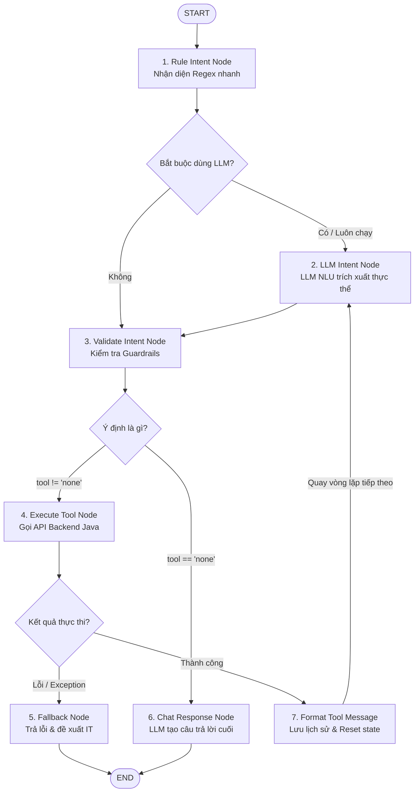

# KIẾN TRÚC MULTI-STEP AI AGENT VỚI LANGGRAPH & KỊCH BẢN THUYẾT TRÌNH ĐỒ ÁN TỐT NGHIỆP

Tài liệu này cung cấp toàn bộ chi tiết kỹ thuật về kiến trúc đồ thị LangGraph (Multi-step Loop Agent) mới nâng cấp của Hệ thống Quản lý Chuỗi Nhà trọ, kèm theo **Kịch bản thuyết trình** và **Bộ câu hỏi phản biện** phục vụ Hội đồng Bảo vệ Đồ án Tốt nghiệp.

---

## PHẦN 1: KIẾN TRÚC KỸ THUẬT & LUỒNG XỬ LÝ (FLOW THEORY)

### 1. Ý tưởng thiết kế: Từ Tuyến tính đến Vòng lặp nhiều bước (ReAct Agent)
Trong các hệ thống Chatbot thông thường, luồng xử lý thường là **tuyến tính** (Single-shot NLU): AI đọc câu hỏi -> Đoán ý định (Intent) -> Gọi 1 API duy nhất -> Trả lời.
* **Hạn chế**: Khi người dùng hỏi các câu phức tạp đòi hỏi nhiều nguồn dữ liệu (ví dụ: *"Tìm phòng trống dưới 4 triệu và lọc ra phòng dùng ít điện nước nhất tháng trước"*), hệ thống tuyến tính sẽ bị nghẽn (chỉ gọi được API lấy phòng trống, sau đó tự "bịa" ra số liệu điện nước và trả lời).
* **Giải pháp**: Nâng cấp kiến trúc sang dạng **Vòng lặp nhiều bước (Multi-step Loop)** sử dụng **LangGraph**. AI đóng vai trò là một điều phối viên (Agent) có khả năng tự đánh giá lịch sử hội thoại và kết quả của các công cụ trước đó để quyết định gọi tiếp công cụ tiếp theo hay kết xuất câu trả lời.

---

### 2. Sơ đồ luồng hoạt động (Architecture Graph)

---

### 3. Chi tiết chức năng từng Node trong Đồ thị

1. **`intent_node` (Rule-based)**:
   * Chạy khớp từ khóa nhanh (Regex) để nhận diện các tham số thời gian (tháng, năm), tên chi nhánh sơ bộ nhằm giảm tải cho LLM.
2. **`llm_intent_node` (NLU Engine)**:
   * Sử dụng mô hình ngôn ngữ lớn (LLM) để phân tích ý định dựa trên **Lịch sử hội thoại** + **Tin nhắn mới nhất**. 
   * Trích xuất các thực thể (`branch_name`, `month`, `year`, `status`) dưới dạng JSON.
   * **Điểm sáng**: Nếu lịch sử đã có kết quả chạy của công cụ bước trước, LLM sẽ tự động phân tích để quyết định gọi công cụ bước tiếp theo hoặc trả về `none` để kết thúc vòng lặp.
3. **`validate_intent_node`**:
   * Kiểm tra tính hợp lệ của tham số đầu vào (ví dụ: tháng phải từ 1-12, năm từ 2020-2026).
   * **Chốt chặn vòng lặp (Max Loops Guardrail)**: Nếu phát hiện số vòng lặp `loop_count >= 5`, hệ thống sẽ ép `intent` về `"none"` để tránh hiện tượng Agent bị lặp vô hạn gây tốn tài nguyên.
4. **`execute_tool_node`**:
   * Ánh xạ tên ý định sang API Java Backend tương ứng (sử dụng registry đăng ký công cụ).
   * Gọi API, xử lý dữ liệu trả về hoặc bắt lỗi kết nối.
5. **`format_tool_message_node`**:
   * Format kết quả trả về từ API thành một tin nhắn có cấu trúc dạng: `[Hệ thống đã chạy công cụ 'A'...]`.
   * Ghi tin nhắn này vào lịch sử hội thoại (`messages`).
   * Reset trạng thái intent tạm thời và tăng `loop_count` lên 1 để chuẩn bị cho lượt phân tích tiếp theo.
6. **`chat_response_node`**:
   * Node đích cuối cùng của luồng thành công. LLM sẽ đọc toàn bộ lịch sử (bao gồm cả các dữ liệu thật thu được từ các API đã chạy ở các bước trước) để biên dịch thành câu trả lời tự nhiên, thân thiện và chính xác tuyệt đối theo khuôn mẫu Markdown quy định.
7. **`fallback_node`**:
   * Xử lý lỗi khi API backend bị lỗi (HTTP 500, 400 hoặc crash). Không gọi LLM phân tích để tránh mô hình tự đoán mò, mà trả thẳng câu thông báo chuẩn hóa hướng dẫn người dùng liên hệ bộ phận IT.

---

## PHẦN 2: KỊCH BẢN THUYẾT TRÌNH BẢO VỆ ĐỒ ÁN (7 - 10 PHÚT)

### 📌 Slide 1: Đặt vấn đề & Mục tiêu Đề tài
* **Người trình bày nói**: 
  > *"Kính thưa Hội đồng, trong quản lý chuỗi nhà trọ, chủ nhà trọ thường xuyên phải đối mặt với lượng dữ liệu khổng lồ về doanh thu, phòng ốc, chỉ số điện nước và nợ nần của cư dân. Để truy xuất nhanh các báo cáo này mà không cần thao tác qua nhiều màn hình click chuột phức tạp, em đã nghiên cứu và phát triển trợ lý ảo AI thông minh tích hợp trực tiếp vào hệ thống quản lý."*

### 📌 Slide 2: Kiến trúc Hệ thống tích hợp AI
* **Người trình bày nói**:
  > *"Hệ thống của chúng em được xây dựng trên mô hình phân tách rõ ràng:
  > - **Java Spring Boot Backend**: Đảm nhận quản lý cơ sở dữ liệu MySQL, xử lý các nghiệp vụ cốt lõi và cung cấp các REST API bảo mật cho AI.
  > - **FastAPI AI Service**: Được viết bằng Python, tích hợp thư viện **LangGraph** để xây dựng luồng xử lý AI dưới dạng các nút trạng thái (State Graph). Sự kết hợp này mang lại sự linh hoạt tối đa cho trợ lý ảo."*

### 📌 Slide 3: Điểm sáng công nghệ - Multi-step Agent với LangGraph
* **Người trình bày nói**:
  > *"Điểm đặc biệt và độc đáo nhất trong nghiên cứu của em là việc nâng cấp Chatbot từ dạng tuyến tính thông thường lên dạng **Agent vòng lặp nhiều bước (Multi-step Agent)**. 
  > Trợ lý ảo của em không chỉ giải đáp các câu hỏi đơn lẻ mà có khả năng **lập kế hoạch tự động** để giải quyết các yêu cầu phức tạp của người dùng. Đồ thị LangGraph sẽ duy trì trạng thái hội thoại, gọi liên tiếp nhiều API cần thiết, tích lũy dữ liệu vào lịch sử hội thoại trước khi đưa ra câu trả lời cuối cùng."*

### 📌 Slide 4: Demo kịch bản thực tế (Trọng tâm)
*(Chiếu màn hình Chat hoặc Log console của câu hỏi phức tạp)*
* **Người trình bày nói**:
  > *"Em xin demo một tình huống thực tế cực kỳ phức tạp: Người dùng hỏi: **'Em kiểm tra xem chi nhánh Thủ Đức còn phòng trống nào giá dưới 4 triệu không? Nếu còn thì lọc ra phòng có chỉ số điện nước tháng trước thấp nhất để soạn hợp đồng.'**
  >
  > Nhìn vào Log hệ thống, chúng ta có thể thấy luồng hoạt động của đồ thị LangGraph diễn ra như sau:
  > - **Vòng lặp 1**: AI phân tích và phát hiện cần tìm phòng trống. Node `execute_tool` kích hoạt API `/vacant-rooms-list` của Java backend. Backend trả ra 3 phòng: A102 (2.6M), A201 (2.8M) và A202 (3M).
  > - **Vòng lặp 2**: Dữ liệu phòng trống được nạp vào lịch sử. AI nhận thấy cần so sánh điện nước tháng trước của 3 phòng này. Hệ thống tự động kích hoạt tiếp API `/utility-stats` của chi nhánh Thủ Đức.
  > - **Vòng lặp 3**: Sau khi nhận được dữ liệu tiêu thụ điện nước, AI nhận diện đã đủ thông tin. Trạng thái chuyển sang `none` để kích hoạt `chat_response_node`.
  > - **Kết quả**: LLM tự động so sánh, tìm ra phòng A102 có chỉ số điện nước thấp nhất và tự động soạn thảo mẫu hợp đồng kèm tiền cọc mặc định 1 tháng để gửi trực tiếp cho sếp ngay trên khung chat."*

### 📌 Slide 5: Cơ chế an toàn dữ liệu & Chống "Bốc phét" (Anti-Hallucination)
* **Người trình bày nói**:
  > *"Để đảm bảo tính ứng dụng thực tế của đồ án, chúng em thiết lập các chốt chặn an toàn:
  > 1. **Fuzzy matching (So khớp mờ)**: Sử dụng truy vấn SQL `LIKE` tại Spring Boot giúp AI tự động ánh xạ đúng tên chi nhánh viết tắt (ví dụ: 'Thủ Đức' thành 'Nhà trọ Thủ Đức').
  > 2. **Chặn lỗi bốc phét**: Thiết lập Quy tắc số 10 trong prompt hệ thống, bắt buộc AI từ chối trả lời và đề nghị liên hệ bộ phận IT nâng cấp khi không có công cụ lấy dữ liệu hoặc gặp sự cố backend (thay vì tự chế ra số liệu giả)."*

### 📌 Slide 6: Kết luận & Hướng phát triển
* **Người trình bày nói**:
  > *"Đề tài đã ứng dụng thành công LangGraph để giải quyết bài toán hội thoại phức tạp trong quản lý nhà trọ. Hướng phát triển tiếp theo của nhóm là tích hợp thêm các công cụ tạo trực tiếp hợp đồng xuống Database và gửi thông báo tự động qua Zalo/Telegram cho khách thuê. Em xin chân thành cảm ơn thầy cô đã lắng nghe!"*

---

## PHẦN 3: BỘ CÂU HỎI PHẢN BIỆN THƯỜNG GẶP CỦA HỘI ĐỒNG (Q&A)

#### 💬 Câu hỏi 1: Tại sao em lại chọn LangGraph thay vì các framework chatbot thông thường như Rasa hay Dialogflow?
* **Trả lời pro**: 
  > *"Kính thưa thầy cô, Rasa hay Dialogflow quản lý hội thoại dựa trên các kịch bản định sẵn (rule-based hoặc intent-based tĩnh). Đối với các bài toán cần gọi chuỗi API linh hoạt dựa trên ngữ cảnh động và dữ liệu trả về từ Database thì các công cụ trên rất khó cấu hình và bảo trì. 
  > LangGraph cho phép chúng em định nghĩa luồng xử lý dưới dạng đồ thị trạng thái (State Graph). Chúng em có thể kiểm soát hoàn toàn việc chuyển trạng thái giữa các Node, dễ dàng lặp lại việc gọi các công cụ (tools) khác nhau dựa trên tư duy lập luận của mô hình ngôn ngữ lớn (LLM), giúp giải quyết các nghiệp vụ phức tạp mà các nền tảng chatbot cũ không làm được."*

#### 💬 Câu hỏi 2: Cơ chế vòng lặp nhiều bước (multi-step) có thể dẫn tới vòng lặp vô hạn nếu AI nhận diện sai hay không? Em giải quyết vấn đề này thế nào?
* **Trả lời pro**: 
  > *"Dạ, đây là một thách thức rất lớn trong các hệ thống Agent. Để khắc phục, em đã triển khai chốt chặn **Max Loops Guardrail** trong Node `validate_intent_node`. Hệ thống lưu biến `loop_count` trong `AgentState`. Nếu số lần gọi công cụ vượt quá 5 lần mà AI vẫn chưa dừng lại, đồ thị sẽ tự động ngắt luồng gọi công cụ, chuyển hướng sang `chat_response_node` để trả lời trực tiếp hoặc thông báo cho người dùng, đảm bảo không bao giờ xảy ra tình trạng lặp vô hạn gây tốn tài nguyên API."*

#### 💬 Câu hỏi 3: Nếu kết nối từ FastAPI sang Spring Boot Backend bị đứt hoặc lỗi (ví dụ: database bị lock), Chatbot sẽ xử lý thế nào để người dùng không thấy các lỗi kỹ thuật thô kệch?
* **Trả lời pro**: 
  > *"Dạ, em đã xây dựng nút **`fallback_node`** chuyên biệt để bắt các lỗi ngoại lệ (RuntimeException/HTTP errors) từ Backend. Khi xảy ra lỗi trong quá trình thực thi công cụ, hệ thống sẽ bỏ qua việc gọi LLM phân tích lỗi (tránh LLM tự đoán mò làm hoang mang người dùng) mà trả thẳng một câu thông báo chuẩn hóa cực kỳ thân thiện: 'Dạ sếp ơi, hệ thống đang gặp chút sự cố kết nối dữ liệu, sếp vui lòng thử lại sau hoặc liên hệ bộ phận IT nhé!'. Điều này giúp nâng cao trải nghiệm người dùng và tính bảo mật của hệ thống."*
